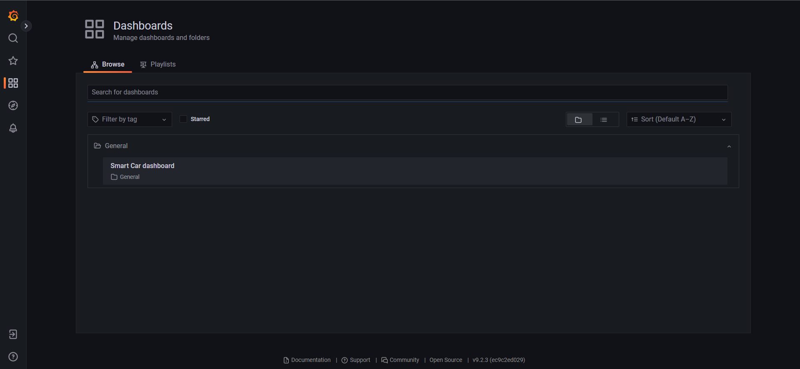

# S22 Data ScienceTech Institute (DSTI) DevOps Project


## Author

Ana Escobar Llamazares - [ana.escobar-llamazares@edu.dsti.institute](mailto:ana.escobar-llamazares@edu.dsti.institute)


## Tree structure of the project
    ├── .github                     : CI/CD pipeline using GitHub Actions
       └── workflows                : Contains yaml files that trigger the workflows in GitHub Actions.
            ├── cd_terraform.yaml 
            ├── push_to_dockerhub.yaml 
            └── test_on_push.yaml 
    ├── iac                         : Infrastructure as Code
        ├── vagrant                 : Configured VM with Vagrant and provisioned the virtual environment using Ansible
            ├── .vagrant
            ├── .gitignore
            ├── playbooks
                └── roles
                    └── gitlab
                        ├── healthchecks
                            └── tasks
                                └── main.yml 
                        └── install 
                            └── tasks
                                └── main.yml
            └── Vagrantfile 
        ├── terraform               : Bonus IaC using Terraform (HashiCorp)
            ├── .terraform
            ├── .gitignore
            ├── config.tf
            ├── data.tf
            ├── main.tf
            ├── outputs.tf
            ├── terraform.tfstate
            ├── terraform.tfstate.backup
            └── variables.tf 
        └── README.md               : Further explanations on IaC part
    ├── image                       : Folder containing all the images used in the README.md files.
    ├── istio                       : Service Mesh using Istio
        ├── README.md               : Further explanations on Service Mesh
        └── canary-deployment.yml 
    ├── k8s                         : Docker orchestration using Kubernetes, configuration files
        ├── deployment.yaml
        ├── kustomization.yaml
        ├── mongo-deployment.yaml
        ├── mongo-pv.yaml
        ├── mongo-pvc.yaml 
        └── README.md
    ├── monitoring                  : Monitoring part using Prometheus and Grafana
        ├── grafana
            ├── dashboards
                └── web.json
            ├── config.ini
            ├── dashboard.yml
            └── datasource.yml
        ├── prometheus
            └── prometheus.yml
        └── README.md               : Further explanations on Monitoring part
    ├── smart_carapi                : Main application
        ├── car_instance
        ├── helpers
        ├── modules
        ├── tests
        ├── .dockerignore
        ├── __init__.py
        ├── app.py
        ├── CHANGELOG.md
        ├── Dockerfile
        ├── README.md
        └── requirements.txt 
    ├── .env                        : File to store environment variables (not published)
    ├── .gitignore      
    ├── __init__.py
    ├── .docker-compose.yaml        : Docker Compose yaml file for container orchestration
    └── setup.py                    : Setup python file of the project

All folders contain its own `README.md` file with further explanations except `.github` folder which is the one 
containing the CI/CD pipeline workflows triggered by GitHub Actions on every push to any branch or pull request (PR) to 
the main branch. There are three different workflows configured, using GitHub secrets for security reasons when pushing 
the code, that will be triggered one after the other:


### test_on_push.yaml

First workflow triggered. It executes the tests defined for the main application in `smart_carapi > tests`.


### push_to_dockerhub.yaml

If the first workflow (`test_on_push.yaml`) is successful, this workflow is triggered. It builds and pushes the docker 
image of the main application to the Docker Hub Registry.


### cd_terraform.yaml

If the previous workflow (`push_to_dockerhub.yaml`) is successful, this workflow is triggered. It deploys on AWS the 
main application using terraform. It saves the state of the application everytime terraform is applied and redeployed, 
so it only redeploys the changes, if any. This makes the deployment faster.


## Environment Variables

| Variable                     | Description                                             |
|------------------------------|---------------------------------------------------------|
| `ENVIRONMENT`                | LOCAL or PRODUCTION                                     |
| `MONGO_INITDB_ROOT_USERNAME` | Mongo DB Root Username                                  |
| `MONGO_INITDB_ROOT_PASSWORD` | Mongo DB Root Password                                  |
| `GRAFANA_USERNAME`           | Grafana Username                                        |
| `GRAFANA_PASSWORD`           | Grafana Password                                        |
| `AWS_ACCESS_KEY`             | AWS Access Key                                          |
| `AWS_SECRET_ACCESS_KEY`      | AWS Secret Access Key                                   |
| `DOCKER_HUB_USERNAME`        | Docker Hub registry username                            |
| `DOCKER_HUB_TOKEN`           | Docker Hub registry Token                               |
| `TF_CLOUD_TOKEN`             | Terraform Cloud Token to automate the deployment in AWS |


## Container orchestration using Docker Compose

In the `docker-compose.yaml` file the following containers are defined:
- **mongodb**: 
  - using mongodb docker image
  - default environment variables set
  - port 27017
  - volume defined
- **mongo-express** (manages the database through the web browser)
  - using mongo-express docker image
  - default environment variables set
  - depends on mongodb, which means it will wait until mongodb container is running
  - port 8081
- **web**
  - using my docker image from my docher hub registry
  - default environment variables set
  - depends on mongodb, which means it will wait until mongodb container is running
  - port 5000
  - volume defined
- **prometheus**
  - using prom/prometheus docker image
  - depends on the web application, which means it will wait until web container is running
  - port 9090
  - set volume config yml file from `monitoring > prometheus > prometheus.yml`
- **grafana**
  - using grafana/grafana-oss docker image
  - depends on prometheus, which means it will wait until prometheus container is running
  - port 3000
  - set volumes from `monitoring > grafana ` (all files)

All containers are defined in the same network `host`.


### Run this configuration locally

Open a terminal and locate yourself at the root of the project , `devops-smart-car`, and execute the following command 
to run the configuration from the `docker-compose.yaml` file (make sure the docker daemon is running):
```shell
docker compose up
```

The first time it might take a while to download all the images if you don't have them already locally, after that you 
can access the resources in your web browser:

`localhost:8081` -> Mongo Express


`localhost:5000` -> Flask Web Application


`localhost:9090` -> Prometheus


`localhost:3000` -> Grafana




To stop the containers simply type `Ctrl + C`.


# Bonus tasks:

- **Part 1 - Web application:**
  - Python programming language (Flask REST API)
  - Mongodb as Database
  - Swagger documentation
  - Application fully tested
  - Several endpoints developed
  - Used environment variables for security
- **Part 2 - CI/CD Pipeline:**
  - Deployment (CD) using AWS (Amazon Web Services)
  - Used GitHub Secrets for security
- **Part 3 - IaC:**
  - Terraform
  - Automatize process through GitHub Actions to re-deploy on every push/pull-request
  - GitLab -> Added more health checks
- **Part 4 - Build Docker image:**
  - Automatize process through GitHub Actions to build and push Docker Image on every push/pull request
- **Part 5 - Container Orchestration using Docker Compose:**
  - Deployed mongo-express in addition to mongodb, the web application, prometheus and grafana
- **Part 8 - Monitoring:**
  - Created personalised dashboard in Grafana linking it to Prometheus
- **Other**:
  - Git:
    - Created a branch for the development of each part
    - Pull request for each merge into main branch
    - Squash merges on pull requests to main branch
