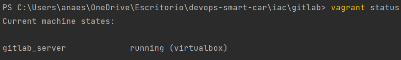
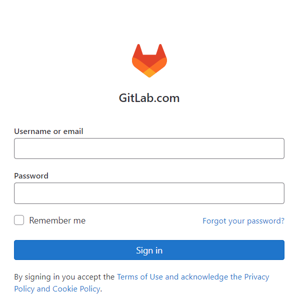
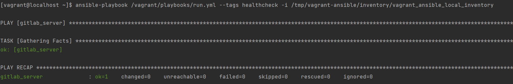
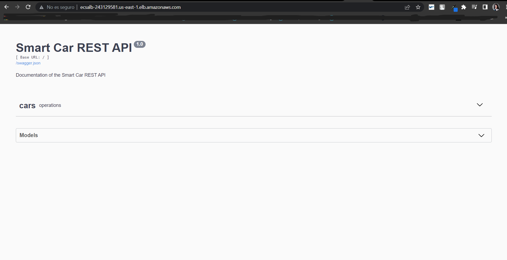

# Infrastructure as Code

## GitLab using Vagrant and Ansible Provisioner (Declarative)

In this task, Gitlab on CentOs was installed. Used `ansible_local` provisioner which installs `Ansible` on CentOS 7 Linux 
distribution VM by `Vagrant`.

All the configuration files for this task are under `gitlab` folder.

The `Vagrantfile` defines the VMs to be managed by Vagrant.

Under the `playbooks` directory all the Ansible playbooks to install GitLab and run health checks can be found.


### Prerequisites
In your terminal, under the `iac/vagrant` folder:

````shell
vagrant box add centos/7
# Enter choice 3 to use virtualbox
````


### Instructions

Still in the same directory, create and provision a VM:

````shell
vagrant up
````

Check the status:
````shell
vagrant status
````



Open in your browser the URL `http://localhost:8080`, you will visualize the GitLab sign in page as the VM is successfully provisioned.




Now, run the `gitlab/healthcheck` role:

````shell
vagrant ssh
````

````shell
ansible-playbook /vagrant/playbooks/run.yml --tags healthcheck -i /tmp/vagrant-ansible/inventory/vagrant_ansible_local_inventory
````



You can check under `vagrant > playbooks > roles > healthchecks > tasks > main.yml` file all the types of health check provided:
- health
- readiness
- liveness


## Terraform (Declarative)

Terraform is an IaC tool that lets you build, change, and version cloud and on-prem resources safely and efficiently.

The configuration files under the folder `iac/terraform` describe to Terraform the components needed to run the web application.

In this case, AWS was used to deploy the Docker image of the Web Application using AWS ECS, make sure you're logged in
your AWS account in order to run the following commands.

Terraform flow:

````shell
terraform login     # To login in terraform cloud (optional)
terraform init      # Initialize terraform in current folder
terraform fmt       # Formats terraform files
terraform validate  # Validates terraform files, syntax
terraform plan      # Shows plan (what are the things that will be deployed and what hasn't change from the .tfstate)
terraform apply     # Applies the previous plan
terraform destroy   # Destroys all resources
````

After executing `terraform apply` you will have to wait a couple of minutes for the process to finish. Once everything
is deployed in AWS you will get an output variable, the one under `terraform > outputs.tf` file, the Application Load 
Balancer DNS name. This is the public URL to access the Web Application in any browser.



This whole process is now automatize using GitHub Actions. See the workflow in `.github > workflows > cd_terraform.yaml`
file. It is triggered in every push/pull request and the deployment and .tfstate updated accordingly.

**Note**: A new tag for the Docker image was created for this deployment. `smartcarapi:tf` is the image used for this deployment.
