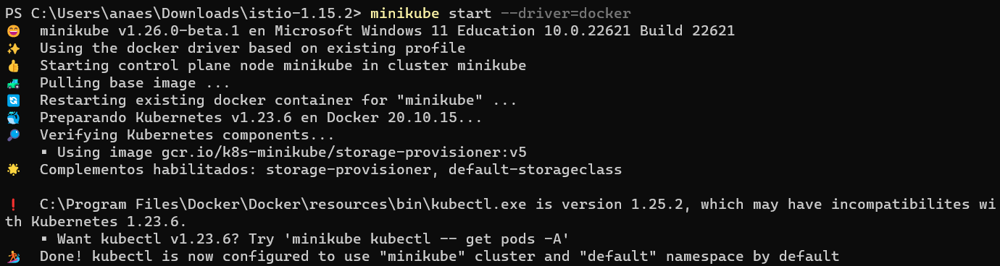
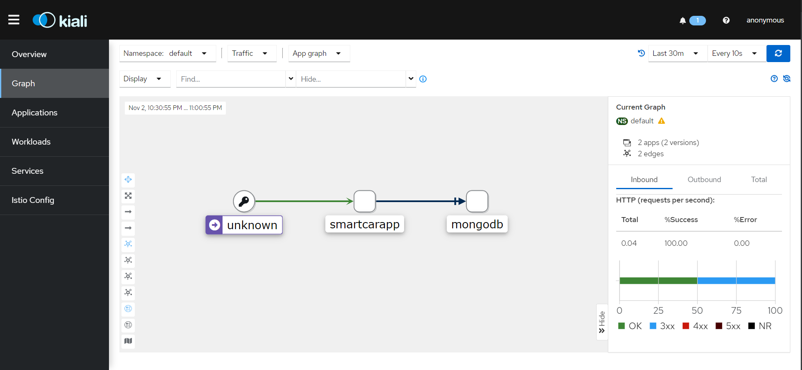

# Service mesh using Istio

## Traffic management using Istio and Python Flask

The first step is to install istioctl. For that, you need to be under the `istio` folder since `istio-1.15.2` folder is
located inside. 

Types of profiles available:


Istioctl is installed using demo profile since it's the most complete one:

````shell
istioctl install --set profile=demo -y
````

What does this profile have configured by default?

````shell
istioctl profile dump
````


Now, we start minikube with docker driver:

````shell
minikube start --driver=docker
````



Once the profile is applied, you can see the running required services/pods in your Kubernetes cluster.

````shell
kubectl get pods -n istio-system
````

Label a namespace with `istio-injection=enabled` to provide communication control to Istio in the namespace.

````shell
kubectl label namespace default istio-injection=enabled
````

Now, the namespace is ready for the app deployment.

````shell
kubectl get ns --show-labels
````


The app deployment was done from the Kubernetes part.

````shell
kubectl get pods -o wide
````

Once deployment is done, Istio will inject a sidecar proxy to handle all ingress and egress traffic. 
So when you list the pods, you can see 2 containers are running in `READY` column. 
The first container is our app and the second one is sidecar Envoy proxy by Istio.


Let's check the existing Istio components and Application state.

````shell
kubectl get svc
````

````shell
kubectl get gateway
````

````shell
kubectl get virtualservice
````


To get an overview of the mesh:

````shell
istioctl proxy-status
````


Check the state of Istio specific components:

````shell
istioctl proxy-config route istio-ingressgateway-84f4959778-f4k5q -n istio-system
````


### Canary Rollout Deployment

This deployment strategy releases an application or service incrementally to a subset of users who are exposed to new 
updated before others. Istio, as a service mesh supports routing rules to be applied to all services in the mesh, not 
just to ingress traffic. Using this capability we can implement Canary deployment easily. Canary deployments in Istio 
can be configured using virtual services and destination rules.

Check the file `canary-deployment.yml` where you can visualize all the configuration used for this deployment. It uses
weight-based routing, 80% to v1 and 20% to updated version (percentage of requests).

To apply this configuration:

````shell
kubectl apply -f canary-deployment.yml
````

To access the service through the web browser:

````shell
minikube service smartcarapp-svc
````


We can run the `kiali` dashboard, `prometheus` dashboard and `grafana` dashboard.

````shell
istioctl dashboard kiali
````




````shell
istioctl dashboard prometheus
````


````shell
istioctl dashboard grafana
````


**Objectives achieved:**
- Deployed the Flask App in Istio controlled namespace.
- Deployed Prometheus, Grafana, and Kiali add-ons to the Istio control plane.
- Applied Canary Rollout Deployment for versioning
