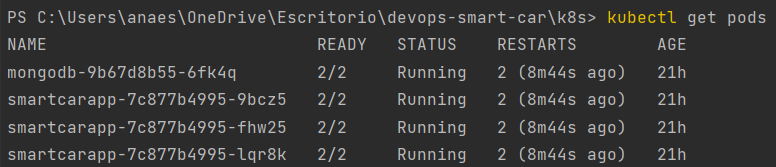
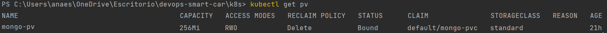
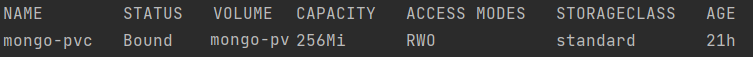
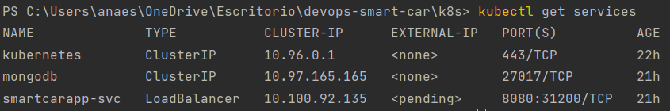
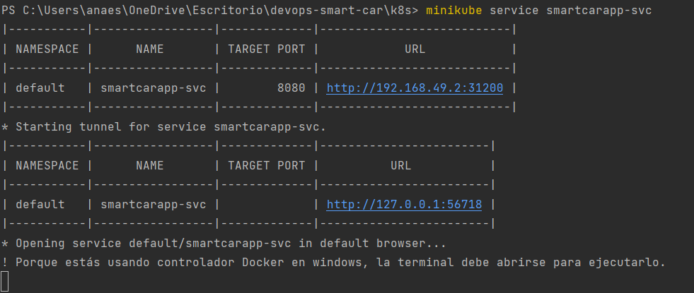
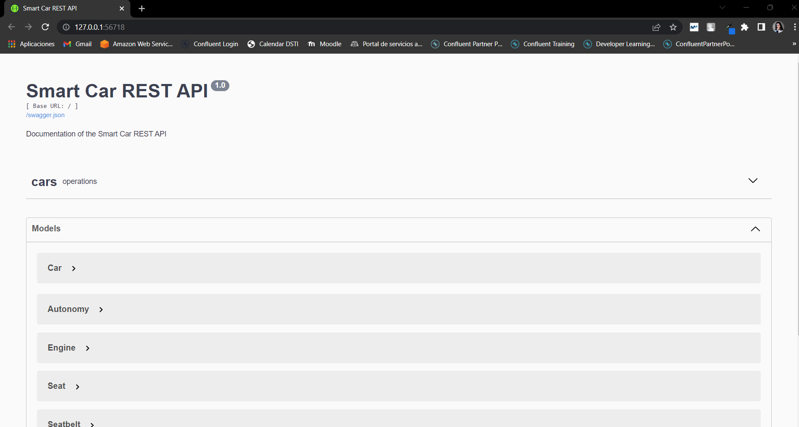
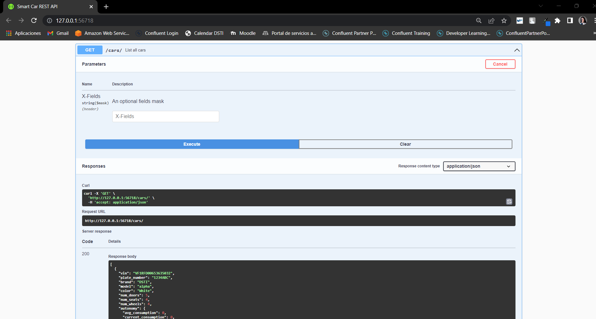

# Docker orchestration using Kubernetes

For this part, `minikube` with docker driver was set up.

````shell
minikube start --driver=docker
````

Check minikube status:

````shell
minikube status
````

Under `k8s` folder we can find all the files used in this part:
- **deployment.yaml** : deployment of the image in my docker registry od the Web Application + LoadBalancer service to 
enable the pods to be accessible from outside the cluster.
- **mongo-deployment.yaml** : mongodb deployment using docker image + ClusterIp service since we don't want the database 
to be accessible from the outside.
- **mongo-pv.yaml** : the contents of this volume persist, even if the MongoDB pod is deleted or moved to a different node.
- **mongo-pvc.yalm** : claim/obtain the storage created on mongo-pv.yaml and can be mounted on the mongo container.
- **kustomization.yaml** : runs all the resource files under the `resources` label.


All the files can be applied at once by running the `kustomization.yaml` file:

````shell
kubectl apply -k .
````

Or they can be created one by one:

````shell
kubectl create -f mongo-pv.yaml
````

````shell
kubectl create -f mongo-pvc.yaml
````

````shell
kubectl create -f mongo-deployment.yaml
````

````shell
kubectl create -f deployment.yaml
````

Check configuration:

````shell
kubectl get pods
````



````shell
kubectl get pv
````



````shell
kubectl get pvc
````



````shell
kubectl get services
````



Access to `smartcarapp-svc` service using minikube tunnel:

````shell
minikube service smartcarapp-svc
````





Checking that mongodb is well configured by making a GET request to the API:


