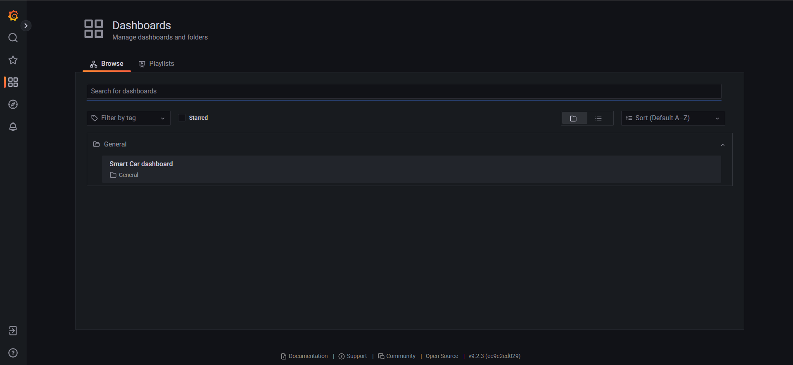
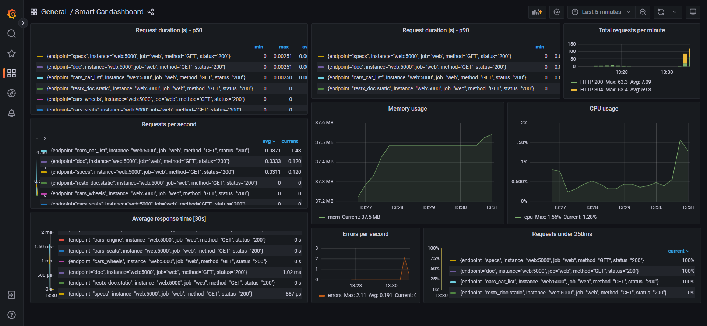

# Implement Monitoring to the containerized application

Monitoring with `Prometheus` was configured in several parts of this project:
- Using the libraries `prometheus_client`, `flask_prometheus_metrics`, `prometheus_flask_exporter` to configure it locally.
`smart_carapi > app.py` file.
- In `docker-compose.yaml` file as a container

As seen in the main README.md file at the root of this project `devops-smart-car`, monitoring with `Grafana` and 
`Prometheus`  was implemented in `docker-compose.yml` file to monitor the containerized application.

In this folder you can find the configuration files for Prometheus under `prometheus` folder and for Grafana under `granafa`
folder. For grafana, a custom and personalized dashboard was built and configured linking prometheus to it.

