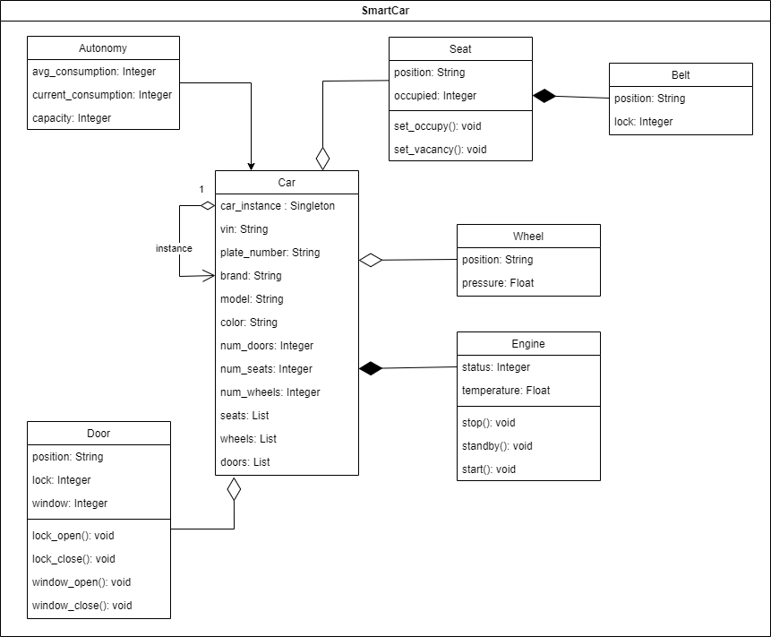
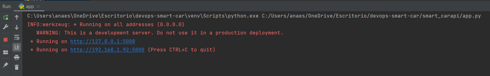
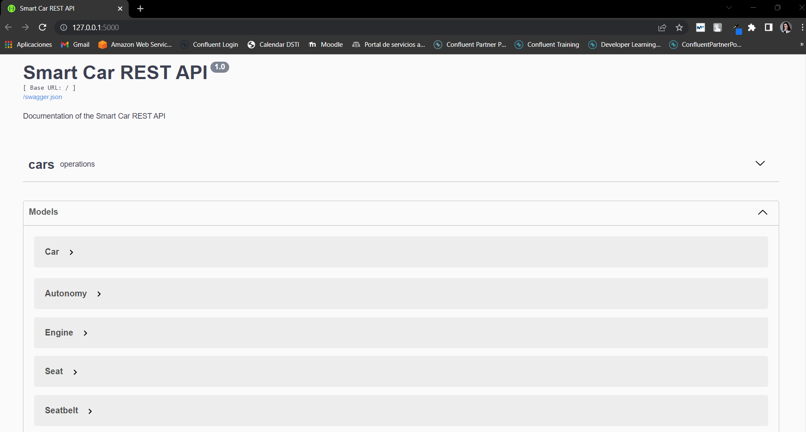

# Web Application

## Specifications

This Web Application was created using Python programming language with Flask and Swagger, and Mongo Database for data 
storage.
It consists of a Web Application that manages and monitors your smart car(s). 
It's implemented using the `Singleton Pattern` so only one instance of the car is available per container.
This would be the software architecture of the system:




## Structure

### car_instance folder
This folder contains the singleton instance to instantiate the Car object.

### helpers folder
The main purpose of this folder is to avoid code repetition and promote reusability through the web application. There's
a `car_factory.py` file used mainly to randomly generate car properties for testing purposes, `config_mongodb.py` where
all the Mongodb methods and configurations are stored and `position.py` that is an Enum Class representing the position 
property in several classes.

### modules folder
In this folder, the rest of the classes related to the Car are defined: Autonomy, Belt, Door, Engine, Seat, Wheel.

### tests folder
This folder defines all the tests of the application. There's a test file per module, car test, mongodb test and rest 
api test.
All these tests can be executed at once from the `__init__().py` file.


## Run locally

### Prerequisites

Configure the virtual environment of the project to use `Python3.8`.

To run the web application locally you will need to have installed and running MongoDB.

After that, open a terminal and situate yourself at the root of `smart_carapi` folder. Then execute the following 
command to install the necessary python libraries for the project:

```shell
pip install -r requirements.txt
```

Run the tests to check everything works correctly:

```shell
python -m unittest tests/__init__.py
```


### Start main application 

After all the libraries have been installed and all the test pass, the project is ready. Still at the root of 
`smart_carapi` folder, execute the following command to run the Flask REST API:

```shell
python app.py
```

You will notice in the command line two different URL's will show up. You can use any of them to access to the application
using your browser.



What you will see is the Swagger Documentation located in the main root. From this documentation, you can visualise the
available models to have a more clear image of the system and under the `operations` tab you are able to make API calls
against the Mongo Database. By default, there's one Car in the database so the responses will never be empty.
This system is built this way because it was thought to be integrated with minimum one smart car, more can be added if 
one owner has several smart cars.




## Run using Docker

In this part, `Dockerfile` file and `.dockerignore` are used to build the Docker image of the application and push it to
the Docker Hub Registry. This action is triggered automatically thanks to GitHub Actions once a new change is pushed to 
the repository, have a look at `.github > workflows > push_to_dockerhub.yaml`.


### Dockerfile

From this file you can create the Docker image of the application locally (make sure you have docker installed and the
docker daemon is running). Still at the root of `smart_carapi` folder execute:

```shell
docker build -t <docker-account-name>/<custom-image-name> .
```

To run the Docker image:

```shell
docker run -p 5000:5000 <docker-account-name>/<custom-image-name>
```

And now you can access the same web application through your web browser at `localhost:5000`.


### Docker Hub Registry

Instead of building and running the Docker image locally you can also pull the image already built from my Docker Hub
Registry:

```shell
docker pull -t escobarana/smartcarapi:latest
```

And run the Docker image you just pulled:

```shell
docker run -p 5000:5000 escobarana/smartcarapi:latest
```

Access the same web application through your web browser at `localhost:5000`.
